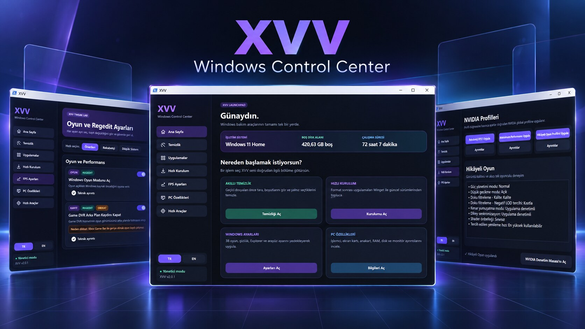

# XVV Windows Control Center

Windows 10/11 için Türkçe ve İngilizce bakım, uygulama kurulumu, sistem bilgisi ve güvenli ince ayar merkezi.

  
  

## Kullanım

1. **XVV ZIP İNDİR** düğmesine bas.
2. ZIP içindeki **XVV** klasörünü Masaüstüne çıkar.
3. **Start-XVV.bat** dosyasına çift tıkla.
4. Regedit ve sistem işlemleri için dosyaya sağ tıklayıp **Yönetici olarak çalıştır** seçeneğini kullan.

> Uygulama açılmazsa klasörü ZIP içinden çalıştırmadığından ve bütün dosyaları birlikte çıkardığından emin ol.

## Neler var?

- Seçmeli akıllı temizlik ve uygulama kaldırma
- Winget ile kategorili, toplu güncel uygulama kurulumu
- Açıklamalı Windows ve Regedit ayarları
- Zorunlu geri yükleme noktası, ayar yedeği ve geri alma
- NVIDIA oyun profilleri
- Ayrıntılı PC, monitör, disk, ağ ve donanım bilgileri
- Türkçe ve İngilizce arayüz

## English

XVV is a bilingual Windows 10/11 maintenance, app installation, hardware information and safe tweaking utility.

Download the latest ZIP above, extract the complete **XVV** folder, then double-click **Start-XVV.bat**. Use **Run as administrator** only for Registry and protected system operations.

## Güvenlik / Safety

XVV does not disable Microsoft Defender or Windows Update and does not bundle third-party executables. Risky settings are marked clearly and changes are backed up before application.

Geliştirici belgeleri: [Katkı](docs/CONTRIBUTING.md) · [Güvenlik](docs/SECURITY.md) · [Değişiklikler](docs/CHANGELOG.md)

MIT © 2026 [iflaholmaz](https://github.com/iflaholmaz)
